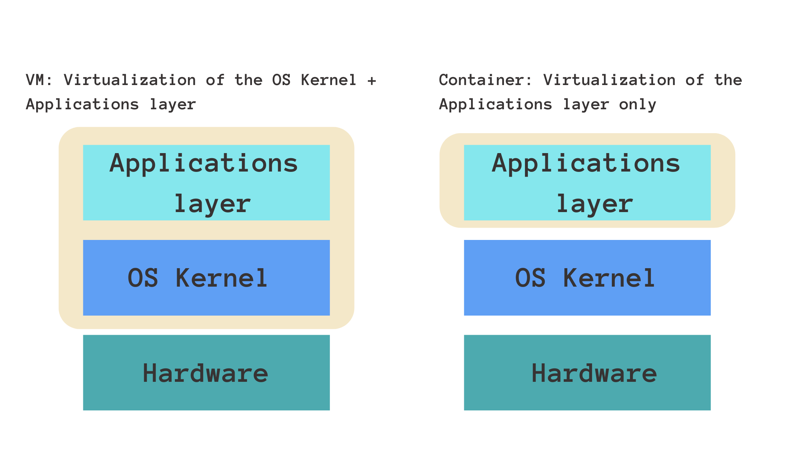

# [Docker: An Introduction](https://www.youtube.com/watch?v=pg19Z8LL06w&ab_channel=TechWorldwithNana)

- [Docker: An Introduction](#docker-an-introduction)
  - [What is Docker?](#what-is-docker)
  - [Deployments](#deployments)
    - [Before Linux Containers](#before-linux-containers)
    - [With Linux Containers](#with-linux-containers)
  - [How Does Docker Operate?](#how-does-docker-operate)
  - [VMs vs Containers](#vms-vs-containers)
  - [Docker Installation](#docker-installation)
    - [Docker Desktop](#docker-desktop)
      - [Key Features](#key-features)
      - [Advantages](#advantages)
    - [Minikube](#minikube)
      - [Key Features](#key-features-1)
      - [Advantages](#advantages-1)
  - [Docker Desktop vs. Minikube: The Showdown](#docker-desktop-vs-minikube-the-showdown)
  - [References](#references)
    - [Further Reading](#further-reading)
    - [Videos](#videos)

## What is Docker?

Docker is an open-source tool that facilitates the automation of deploying applications inside lightweight, portable, and self-sufficient containers.

Main Features:

- `Containerization`: Docker wraps software with all its dependencies into a standardized unit.
- `Portability`: Once containerized, the software can be run consistently across various environments.
- `Microservices`: Docker aids in breaking down applications into smaller, manageable pieces which can be developed, deployed, and scaled individually.

## Deployments

- `Isolation` is the key to running applications securely and efficiently.
- `Virtual Machines (VMs)` and `Linux Containers` are two technologies that enable this isolation.

### Before Linux Containers

In the pre-container era, the predominant model for running applications was to use physical servers or virtual machines (VMs).

- `Physical Servers`:
  - Initially, applications were deployed directly on physical servers.
  - This approach provided good `isolation`
  - `Inefficient`, as you couldn't fully utilize a server's resources if your application didn't need them
  - `Not Scalable` as, running multiple applications on a single server could lead to dependency conflicts and other issues.

- `Virtual Machines`:
  - To improve `resource utilization` with compromising on isolation, virtual machines (VMs) were introduced
  - A `VM simulates a physical computer`, running an entire operating system (OS) and applications on top of a `hypervisor`
  - VMs provide good `isolation`, but they have significant overhead because each VM runs a full OS which results in wasted resources and slower startup times.

### With Linux Containers

- We package applications with their dependencies into a standardized unit for software development, called a `container image`.
- These images bundle the application and all its dependencies, including libraries and other binaries, and ship them as one package.
- `Containers` are instances of these images that can be run using a container runtime.
- Containers are isolated from one another and share `single host OS kernel`.
- They can communicate with each other through well-defined channels.
- `Efficient` - Containers are lightweight and start quickly, fully utilizing the host system's resources.
- `Scalable` - Containers can be easily scaled up or down based on the application's needs.
- `Portable` - Containers can be run consistently across various environments.
- `Standardization` - Containers are deployed in a standard fashion, irrespective of the underlying infrastructure or the application's complexity or technology stack.

## How Does Docker Operate?

At the heart of Docker’s prowess lie several Linux features that enable its unique approach to virtualization:

1. `Control Groups (cgroups)`: They control resources ensuring Docker containers consume only what they're allotted.
2. `Namespaces`: It offers isolation between containers. Each container feels like it’s the sole process holder.
3. `Chroot`: It's a process to change the root directory for a process, allowing Docker to provide isolated file systems to containers.
4. `Union File Systems (UnionFS)`: Allows Docker to create layers, making image creation and container spin-up efficient.
5. `Security Modules (e.g., SELinux, AppArmor)`: They ensure containers cannot negatively impact the host system.

## VMs vs Containers

- Containers and virtual machines are very similar resource `virtualization technologies`
- Virtualization is the process in which a system singular resource like `RAM`, `CPU`, `Disk`, or `Networking` can be ‘virtualized’ and represented as `multiple resources`.
- The key differentiator between containers and virtual machines:
  - Virtual machines virtualize an entire machine down to the `hardware layers`
  - Containers only `virtualize software layers above the operating system level`

| **Attributes**            | **Virtual Machines (VMs)**                                               | **Containers**                                                          |
|-------------------------|-------------------------------------------------------------------------|-----------------------------------------------------------------------------|
| System Overhead          | VMs have a full OS copy, creating higher overhead.                         | With shared host kernel, containers have lesser overhead.                      |
| Boot-Up Time             | VMs boot slower due to a complete OS initialization.                       | Containers boast near-instantaneous boot times.                               |
| Performance              | VMs offer good, but sometimes inefficient performance.                     | Containers, being lightweight, ensure enhanced performance.                    |
| Isolation                | VMs provide stronger isolation since they run separate OS instances.      | Containers offer good isolation but share the host’s kernel.                   |
| Portability              | VMs can suffer from host-guest OS dependency issues.                       | Docker ensures high portability across any Docker-supporting system.            |
| Security                 | VMs offer great security due to robust resource isolation.                 | Containers, while generally secure, might be vulnerable at kernel-level.        |
| Disk Space               | VMs require more space (OS + app).                                         | Containers only house the app and its dependencies, saving space.               |
| Best Use Cases           | Suited for tasks needing full OS resources.                                | Ideal for microservices as they scale components effectively.                   |

## Docker Installation

2 most popular ways to install Docker `locally`:

- `Docker Desktop` (*Recommended for Windows & Mac*)
- `Minikube`

### Docker Desktop

Docker Desktop is an easy-to-use graphical user interface (GUI) tool that provides Docker and Kubernetes functionalities for both macOS and Windows users.

#### Key Features

- `Integrated Development Environment`: It includes a full development environment, including Docker CLI, Docker Compose, and Docker Notary.
- `Built-in Kubernetes`: Comes with a single-node Kubernetes cluster built-in, allowing users to deploy Kubernetes-based applications locally.
- `File Sharing`: Seamless sharing of files between the host and containers.
- `GUI-based Management`: Offers a user-friendly interface to manage images, containers, and networks.

#### Advantages

- `Easy Setup`: Streamlined installation and setup process for both Docker and Kubernetes.
- `Developer-Friendly`: Offers integration with IDEs like Visual Studio Code.
- `Network Integration`: Containers can be accessed using `localhost` on macOS and Windows, thanks to the underlying hypervisor's network integration.

### Minikube

Minikube is an open-source tool specifically designed to run a local Kubernetes cluster on your local machine, primarily for the sake of learning and development.

#### Key Features

- `Single-Node Cluster`: Provides a single-node Kubernetes cluster, great for testing and development.
- `Multiple Hypervisors`: Supports various hypervisors, including VirtualBox, VMware Fusion, and others.
- `Add-ons`: Supports various Kubernetes add-ons, extending its features for development.

#### Advantages

- `Pure Kubernetes Experience`: Offers a closer resemblance to a real-world Kubernetes cluster, allowing users to learn raw Kubernetes.
- `Flexible`: Due to its compatibility with multiple hypervisors, it can be used across many platforms.
- `Customizable`: Minikube's CLI, `minikube`, has numerous commands and flags, allowing users to customize and configure their local cluster.

## Docker Desktop vs. Minikube: The Showdown

| **Criteria**               | **Docker Desktop**                                        | **Minikube**                                           |
|---------------------------|----------------------------------------------------------|-------------------------------------------------------|
| **Primary Use Case**      | Containerization with Docker, and Kubernetes development. | Purely Kubernetes learning and development.            |
| **Platform**              | Windows and macOS.                                        | Windows, macOS, and Linux.                             |
| **Hypervisor Dependency** | Uses underlying platform's hypervisor.                    | Works with multiple hypervisors.                       |
| **Networking**            | `localhost` access on macOS and Windows.                  | `IP-based access` depending on the hypervisor.          |
| **Ease of Use**           | GUI and CLI options. Streamlined setup.                   | More configuration might be required. Pure CLI tool.   |
| **Customizability**       | Limited compared to Minikube.                             | High degree of customization using `minikube` commands.|

## References

### Further Reading

- [Docker Explained: A Beginner’s Guide](https://www.youtube.com/watch?v=pg19Z8LL06w&ab_channel=TechWorldwithNana)
- [Quick Dive into Docker](https://www.youtube.com/watch?v=Gjnup-PuquQ&ab_channel=Fireship)
- [VM vs Containers](https://www.atlassian.com/microservices/cloud-computing/containers-vs-vms)

### Videos

- [Physical Containers vs Virtual Machines vs Containers](https://www.youtube.com/watch?v=dq3SpOGDk60&ab_channel=SrinathChalla)
- [Docker 101](https://www.youtube.com/watch?v=kwsJIH5TGIg)
