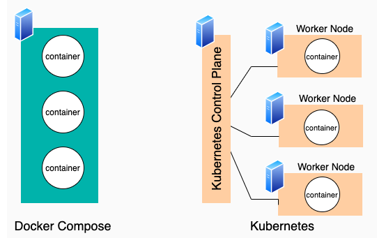

# Docker Compose

- [Docker Compose](#docker-compose)
  - [Multi Container App](#multi-container-app)
    - [Redis as a Docker Container](#redis-as-a-docker-container)
    - [Run App on your Machine Terminal](#run-app-on-your-machine-terminal)
    - [App Containerization](#app-containerization)
  - [Run App Without Docker Compose](#run-app-without-docker-compose)
    - [Running App as a container](#running-app-as-a-container)
    - [Docker Network](#docker-network)
    - [Connect Redis to Network](#connect-redis-to-network)
    - [Connect App](#connect-app)
    - [Debugging network](#debugging-network)
    - [Summary](#summary)
  - [Run App With Docker Composer](#run-app-with-docker-composer)
  - [Docker Compose Primer](#docker-compose-primer)
    - [Key Features](#key-features)
    - [Benefits of Docker Compose](#benefits-of-docker-compose)
  - [Docker Compose vs K8s](#docker-compose-vs-k8s)
  - [References](#references)

Docker Compose was primarily designed to facilitate the orchestration of `multi-container` applications.

But it simplifies the process of running any docker container by documenting all the command line information in a single file

It simpifies connecting containers & other resources together.

To elaborate, follow the example below.

## Multi Container App

Let's build a multi-container `counterapp` with `expressjs` & `redis` to track the number of times the api is called.

- Here, `expressjs` app with only 2 files:

  a. **package.json**:

```json
{
  "name": "node-app",
  "version": "1.0.0",
  "description": "",
  "main": "index.js",
  "scripts": {
    "start": "node app.mjs"
  },
  "author": "",
  "license": "ISC",
  "dependencies": {
    "express": "^4.18.2",
    "redis": "^4.6.7"
  }
}
```

  b. **app.mjs**

```js
import express from 'express'
import redis from 'redis'

const app = express()

const { REDIS_URL = 'redis://localhost:6379' } = process.env;
console.log(`Redis URL: ${REDIS_URL}`)

const redisClient = redis.createClient({
    url: REDIS_URL
})

app.get('/', async (_req, res) => {
    try {
        let visits = await redisClient.get('visits')
        visits = parseInt(visits)
        await redisClient.set('visits', visits + 1)
        res.json({ noOfVisits: visits })
    } catch (err) {
        console.log(err)
        res.status(500).json({ message: 'server error'})
    } 
})

const PORT = process.env.PORT || 3001
app.listen(PORT, async () => {
    console.log(`Server is listening on port ${PORT}`)
    try{
        await redisClient.connect()
        await redisClient.set('visits', 0)
        console.log('Connected to Redis server')
    } catch (err) {
        console.log(err)
    }
})
```

`This app connects with a redis-server running locally at 6379 to track the api count`

### Redis as a Docker Container

- To run the app, we need a redis. Let's run as a docker container:
  
```bash
docker run -d --rm --name redis-container -p 6379:6379 redis
```

### Run App on your Machine Terminal

- Now, run your nodejs app locally:

```bash
npm start
```

- Call the `home` route & it would work perfectly file

### App Containerization

- Dockerfile to make an image

```dockerfile
# Specify base image
FROM node:18-alpine

WORKDIR /app

# Copy package.json & install dependencies
COPY package.json .
RUN npm install --production

# Copy rest of the code
COPY . .

CMD npm start
```

- Build Image:

```bash
docker build -t counterapp .
```

## Run App Without Docker Compose

In this sceanrio, we will run app using `docker-cli` only.

### Running App as a container

```bash
docker run --rm --name counterapp -p 3001:3001 counterapp
```

- When we run this command, it would fail as it cannot connect to redis server with following error:

```log
> node-app@1.0.0 start
> node app.mjs

Server is listening on port 3001
Error: connect ECONNREFUSED 127.0.0.1:6379
    at TCPConnectWrap.afterConnect [as oncomplete] (node:net:1495:16) {
  errno: -111,
  code: 'ECONNREFUSED',
  syscall: 'connect',
  address: '127.0.0.1',
  port: 6379
}
```

- The reason being that the app is running in a container & is trying to search for redis in itself (*locally*), while the redis server is running on the host machine (*as a separate container*).
- To fix it, we need to connect the app container to the redis container.

### Docker Network

- To connect containers, we need to create a docker network:

```bash
docker network create counterapp-network
```

### Connect Redis to Network

- It can be done in 2 ways:

a. Connect existing container:

```bash
docker network connect counterapp-net redis-container
```

b. Connect while creating container:

```bash
docker run -d --rm --name redis-container --network counterapp-net -p 6379:6379 redis
```

- `-p` here is used to access redis from host machine
- It helps in debugging redis using redis-cli
- Otherwise, we don't need to expose the port for communication between containers
- Containers in the same network can communicate with each other using container name

### Connect App

- Network for counterapp needs to be connected at the time of creation only, else connection to redis fails

- We need to pass the `redis-container` as a part of `REDIS_URL` as an environment variable

- Run the app container:

```bash
docker run --rm --name counterapp -p 3001:3001 --network=counterapp-net --env REDIS_URL=redis://redis-container:6379 counterapp
```

- Call the `home` route & it would work perfectly file

### Debugging network

- If you face any issue, the likely cause could be non-alignment of network

- To debug, run the following command:

```bash
docker network inspect counterapp-net
```

### Summary

- To connect containers, we need to create a `docker network`
- Attach redis container to the network
- Create a new app counter with redis-container information at time of creation

## Run App With Docker Composer

- Create a docker-compose.yml file:

```yaml
version: '3'
services:
  redis-container:
    image: 'redis:latest'

  counterapp:
    image: 'counterapp'
    build: .
    ports:
      - '3001:3001'
    environment:
      - REDIS_URL=redis://redis-container:6379
    depends_on:
      - redis-container
```

- Run the app:

```bash
docker compose up
```

- Test the `home` route & it would work perfectly file

In essence, `docker-compose` does the heavy lifting of creating a network & connecting containers to it.

## Docker Compose Primer

1. Docker Compose is a tool primarily used orchestrating `multi-container` Docker applications
2. It could be used to run single container apps as well where all the inputs like `environment variables`, `ports`, `volumes`, etc. are defined in the `docker-compose.yml` file
3. Whatever the case, command to start the app is `docker compose up`
4. Unlike `docker cli`, there is no need to pass the `--rm` flag to remove the container after it exits

If you're accustomed to using individual Docker commands to manage your containers, Docker Compose will streamline this process, allowing you to define entire applications in a single file.

### Key Features

1. **Simplified Management**: Write a `docker-compose.yml` file and start your entire stack with `docker-compose up`.

2. **Enhanced Development Workflow**: Share the same `docker-compose.yml` across your team, ensuring everyone is using the same environment.

3. **Encapsulation of Configuration**: Use different compose files for different environments like development and production.

### Benefits of Docker Compose

- **Consistency**: Guarantees that all environments are identical.
- **Ease of Use**: One command to start/stop the entire application.
- **Version Control**: Keep the `docker-compose.yml` in your version control system for better tracking.
- **Rapid Prototyping**: Quickly spin up development environments.

## Docker Compose vs K8s

This table succinctly highlights the differences between Docker Compose and Kubernetes, showing their respective use cases and functionalities.

| Aspect                      | Docker Compose                                         | Kubernetes                                              |
|-----------------------------|--------------------------------------------------------|---------------------------------------------------------|
| **Primary Use**             | Development & testing environments                    | Large-scale, production environments                    |
| **Complexity**              | Simpler, suitable for local development                | Complex, for managing distributed systems               |
| **Configuration**           | YAML file for services, networks, volumes              | YAML/JSON for pods, services, volumes, etc.             |
| **Scalability**             | Limited scalability                                    | Highly scalable, for large deployments                   |
| **Availability**            | No built-in high availability                          | High availability, load balancing, auto-scaling         |
| **Portability**             | Mostly local; limited portability                      | Across various cloud providers and on-premises          |
| **Development to Production Workflow** | Used for local development                            | Used for production deployment                          |

Nothing explains better than a picture:



- Docker Compose is a tool for defining and orchestrating `multi-container` Docker applications at your local machine.
- While Kubernetes is used for managing `multi-container` applications in your distributed production environment

## References

- [Stephen Grider Docker Compose Explanation](https://www.udemy.com/course/docker-and-kubernetes-the-complete-guide/learn/lecture/11436998#overview)

- [K21Academy](https://k21academy.com/docker-kubernetes/docker-compose-vs-kubernetes/#:~:text=Docker%20Compose%20deploys%20multi%2Dcontainer,multiple%20virtual%20or%20physical%20machines.)

- [Prod Infra by K8s](https://www.theserverside.com/blog/Coffee-Talk-Java-News-Stories-and-Opinions/What-is-Kubernetes-vs-Docker-Compose-How-these-DevOps-tools-compare)

- [Local to Prod](https://levelup.gitconnected.com/docker-compose-vs-kubernetes-understanding-the-differences-and-choosing-the-right-tool-32f3e16fdb43)
