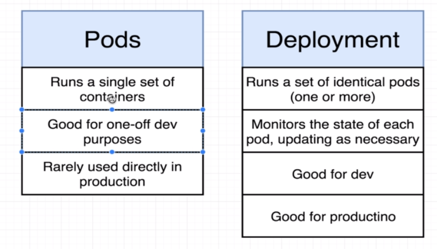

# Kubernetes: A Quick Primer

- [Kubernetes: A Quick Primer](#kubernetes-a-quick-primer)
  - [What is Kubernetes?](#what-is-kubernetes)
  - [Local Deployment](#local-deployment)
  - [Key Concepts](#key-concepts)
    - [Hardware Concepts](#hardware-concepts)
    - [Software Concepts](#software-concepts)
  - [Key Components](#key-components)
    - [Control Plane Components](#control-plane-components)
    - [Node Components](#node-components)
  - [Clarifications](#clarifications)
    - [Namespace](#namespace)
      - [Why Use Namespaces?](#why-use-namespaces)
      - [Creating a Namespace](#creating-a-namespace)
      - [Adding a Namespace](#adding-a-namespace)
      - [Filtering by Namespace](#filtering-by-namespace)
      - [Default Namespaces](#default-namespaces)
      - [Resource Quotas and Limits](#resource-quotas-and-limits)
    - [Labels \& Selectors](#labels--selectors)
      - [Labels](#labels)
      - [Label Selectors](#label-selectors)
        - [Equality-Based Selectors](#equality-based-selectors)
        - [Set-Based Selectors](#set-based-selectors)
    - [Pods vs ReplicaSets vs Deployments](#pods-vs-replicasets-vs-deployments)
  - [K8s Commands](#k8s-commands)
    - [Imperative Commands](#imperative-commands)
    - [Declarative Commands](#declarative-commands)
  - [References](#references)
    - [Amazing Blogs](#amazing-blogs)
    - [Offical Documentation Documentation](#offical-documentation-documentation)
    - [Stephen Grider Tutorial](#stephen-grider-tutorial)

## What is Kubernetes?

- Kubernetes, or `K8s`, is an open-source orchestration system for automating deployment, scaling, and management of containerized applications.
- It manages clusters of servers and runs containers across them, balancing the load.

## Local Deployment

- Multiple known alternatives
- `Docker Desktop` is most popular
- [Refer this doc for details](./K8sWithDockerDesktop.md)

## [Key Concepts](https://kubernetes.io/docs/concepts/overview/)

- The `key concepts` are the fundamental building blocks you work with when defining and interacting with your applications in Kubernetes
- [Refer Amazing Blogs section for details](#amazing-blogs)

### Hardware Concepts

- The Hardware Concepts section refers to the physical or virtual resources used by Kubernetes to  run your applications.

| Concept              | Description                                                                                                  |
|----------------------|--------------------------------------------------------------------------------------------------------------|
| **Node**             | A physical or virtual machine running Kubernetes, capable of hosting Pods.                                   |
| **Cluster**          | A set of worker machines, called nodes, that run containerized applications managed by Kubernetes control planes. |
| **Persistent Volume** | A piece of storage in the cluster that has been provisioned by an administrator or dynamically provisioned using Storage Classes. It is a resource in the cluster just like a node is a cluster resource. |

### Software Concepts

- Encompasses the logical constructs and abstractions that make up Kubernetes' functionality

| Concept                     | Description                                                                                                         |
|-----------------------------|---------------------------------------------------------------------------------------------------------------------|
| **Pod**                     | The smallest deployable unit, encapsulating one or more containers.                                                  |
| **Service**                 | A set of Pods working together, exposed as a network service.                                                        |
| **Deployment**              | Manages the desired state for Pods and ReplicaSets. Supports updates, rollbacks, and scaling.                        |
| **ReplicaSet**              | Ensures that a specified number of replicas of a Pod are running at all times.                                       |
| **Namespace**               | Logical partitioning of a Kubernetes cluster, used to isolate resources.                                             |
| **ConfigMap**               | Allows you to decouple environment-specific configuration from your container images.                                 |
| **Secret**                  | Used to store sensitive information, such as passwords or API keys in `base64` format                                                  |
| **Volume**                  | Represents a storage location, either on the host or a remote storage solution.                                       |
| **Ingress**                 | Manages external access to services within a cluster, typically HTTP.                                                |
| **StatefulSet**             | Manages the deployment and scaling of a set of Pods, with persistent storage and unique network identifiers.          |
| **DaemonSet**               | Ensures all or some Nodes run a copy of a Pod, typically used for node-level system services.                        |
| **Horizontal Pod Autoscaler** | Automatically scales the number of Pods in a deployment, replica set, or replication controller based on observed CPU or memory utilization. |

## [Key Components](https://kubernetes.io/docs/concepts/overview/components/)

- These are the underlying mechanisms that make Kubernetes work as a system
- [Refer doc for details](https://kubernetes.io/docs/concepts/overview/components/)

### Control Plane Components

- Manage the overall state of the cluster

| Component                | Description                                                          |
|--------------------------|----------------------------------------------------------------------|
| **kube-apiserver**       | Exposes the Kubernetes API.                                          |
| **etcd**                 | Consistent and highly-available key-value store for all cluster data. |
| **kube-scheduler**       | Schedules pods to run on nodes.                                      |
| **kube-controller-manager** | Runs controllers for nodes, replicas, endpoints, etc.                |
| **cloud-controller-manager** | Runs controllers specific to the underlying cloud provider.          |

### Node Components

- Run on individual nodes and handle the running of containers

| Component               | Description                                                       |
|-------------------------|-------------------------------------------------------------------|
| **kubelet**             | Ensures that containers are running in a pod.                      |
| **kube-proxy**          | Manages network rules and enables communication to and from your pods. |
| **Container Runtime**   | Software for running containers (e.g., Docker, containerd).       |

## Clarifications

- Following contructs are not very clearly explained

### [Namespace](https://kubernetes.io/docs/concepts/overview/working-with-objects/namespaces/)

- It provides a mechanism for isolating groups of resources within a single cluster.
- Names of resources need to be unique within a namespace, but not across namespaces.
- `Namespace-based scoping` is applicable only for `namespaced objects` (e.g. *Deployments*, *Services*, etc) and not for `cluster-wide objects` (e.g. *StorageClass*, *Nodes*, *PersistentVolumes*, etc).
- Think of them as virtual walls within a Kubernetes cluster that separate different environments, such as development, staging, and production or apps and databases.

#### Why Use Namespaces?

1. `Isolation`: Namespaces provide a scope for names, ensuring that resources are isolated from each other.
2. `Organization`: By grouping related resources together, namespaces simplify management and access control.
3. `Resource Allocation`: You can set resource limits on a per-namespace basis, ensuring fair usage across different teams or applications.
4. `Access Control`: You can set different permissions for different namespaces, allowing precise control over who can do what within each environment.

#### Creating a Namespace

- A namespace can be created using a YAML file like the following:

```yaml
apiVersion: v1
kind: Namespace
metadata:
  name: my-namespace
```

- A simple command-line instruction:

```bash
kubectl create namespace my-namespace
```

#### Adding a Namespace

Once a namespace is created, you can create, view, and manage resources within that namespace. When creating a resource, you can specify the namespace in the YAML file:

```yaml
apiVersion: v1
kind: Pod
metadata:
  name: my-pod
  namespace: my-namespace
```

#### Filtering by Namespace

```bash
kubectl get pods --namespace=my-namespace
```

#### Default Namespaces

Kubernetes comes with a few default namespaces:

- `default`: Where resources are placed if no namespace is specified.
- `kube-system`: Used by resources that are part of Kubernetes itself.
- `kube-public`: Typically used for resources that need to be accessible across the entire cluster.

#### Resource Quotas and Limits

You can set quotas and limits on resources within a namespace to control CPU, memory, and other resource utilization. Here's an example:

```yaml
apiVersion: v1
kind: ResourceQuota
metadata:
  name: my-quota
  namespace: my-namespace
spec:
  hard:
    pods: '10'
    requests.cpu: '4'
```

### Labels & Selectors

#### [Labels](https://kubernetes.io/docs/concepts/overview/working-with-objects/labels/)

- Labels are `key-value` pairs attached to Kubernetes objects like Pods, Services, etc.
- Labels enable users to map their own organizational structures onto system objects in a loosely coupled fashion
- `A single object can have multiple labels.`
- `Labels are not unique`. Similar objects often share labels.
- Labels can be attached to objects at creation time and subsequently added and modified at any time
- Usages:
  - To identify attributes of objects that are meaningful and relevant to users
  - To filter resouces using `label selectors`

```yaml
metadata:
  labels:
    env: prod
    tier: backend
    app: auth
    release: stable
```

- Above example has 3 labels

#### Label Selectors

- Selectors are expressions that match against the labels of resources
- Think of selectors as search queries that find objects with specific labels.
- 2 types of Selectors:

##### Equality-Based Selectors

- Equality-based selectors allow you to filter resources based on exact key-value matches.

```yaml
selector:
  matchLabels:
    env: prod
    app: web
```

- The above example will match resources that have `both` the `env: prod` and `app: web` labels.

##### Set-Based Selectors

- Set-based selectors allow for more flexibility, letting you match resources based on conditions like `existence`, `in`, `not in`, etc.

```yaml
selector:
  matchExpressions:
    - {key: env, operator: In, values: [prod, staging]}
    - {key: app, operator: NotIn, values: [auth]}
    - {key: tier, operator: Exists}
```

In this example:

- The first expression matches if the `env` label has a value of either `prod` or `staging`.
- The second expression matches if the `app` label does not have the value `auth`.
- The third expression matches if the `tier` label exists, regardless of its value.

You can `combine` equality-based and set-based selectors as needed to match resources based on complex criteria.

### Pods vs ReplicaSets vs Deployments

| Feature                      | Pod           | ReplicaSet     | Deployment      |
|------------------------------|---------------|----------------|-----------------|
| **Definition**               | Single unit hosting one or more containers | Ensures desired number of Pods are running | Manages ReplicaSets & enables rolling updates |
| **Granularity**              | Individual container(s) | Group of identical Pods | Manages multiple ReplicaSets for different versions |
| **Scaling**                  | Manual        | Manual         | Automatic (up & down) |
| **Rolling Updates**          | Not supported | Not supported  | Supported        |
| **Rollbacks**                | Not supported | Not supported  | Supported        |
| **Recovery**                 | No automatic replacement | Replaces failed Pods | Replaces failed Pods through ReplicaSets |
| **Versioning**               | N/A           | N/A            | Manages different versions with ease |
| **Use Case**                 | Basic container orchestration | Ensuring specific count of identical Pods | Full application lifecycle management |

**Summary**:

- **Pod:** A foundational unit containing one or more containers. Useful for simple scenarios but lacks automation features.
- **ReplicaSet:** Ensures that a specified number of identical Pods are running. Can replace failed Pods but doesn't support updates or scaling easily.
- **Deployment:** A higher-level abstraction that manages ReplicaSets, providing seamless scaling, updates, rollbacks, and versioning.



## K8s Commands

- Kubernetes supports `imperative` and `declarative` approaches for managing resources
- Here's a comparison in tabular format:

| Aspect                   | Imperative Commands                                       | Declarative Commands                                          |
|--------------------------|-----------------------------------------------------------|----------------------------------------------------------------|
| **Definition**           | Commands that manage resources by direct action.          | Commands that manage resources based on manifest files.        |
| **Usage**                | Utilized for one-off tasks, quick edits, or experimentation. | Used for maintaining the desired state as defined in files.    |
| **Command Examples**     | `kubectl create`, `kubectl run`, `kubectl expose`         | `kubectl apply -f <filename.yaml>`                             |
| **File Requirement**     | No YAML or JSON file required.                            | Requires YAML or JSON file describing the desired state.       |
| **Flexibility**          | Limited in complex scenarios.                             | More flexible and can handle complex configurations.           |
| **State Tracking**       | No automatic tracking of the current state.               | Can track the current state and make updates as needed.        |
| **Recommended For**      | Ad-hoc actions and prototyping.                           | Production environments, version control, and collaboration.   |

### Imperative Commands

- You're explicitly telling the cluster what to do, without describing the complete desired state.
- It's like giving step-by-step directions.

| Command                        | Description                                                  | Example                                           |
|--------------------------------|--------------------------------------------------------------|---------------------------------------------------|
| `kubectl get <resource>`       | List resources like pods, services, etc.                      | `kubectl get pods`                                |
| `kubectl describe <resource>`  | Show detailed information about a resource.                   | `kubectl describe pod my-pod`                     |
| `kubectl create <resource>`    | Create a resource from a file or stdin.                       | `kubectl create -f my-deployment.yaml`            |
| `kubectl delete <resource>`    | Delete resources by filenames, stdin, or resource names.      | `kubectl delete pod my-pod`                       |
| `kubectl apply <resource>`     | Apply changes to resources from a file or stdin.              | `kubectl apply -f my-deployment.yaml`             |
| `kubectl exec`                 | Execute a command in a container.                             | `kubectl exec my-pod -- ls /`                     |
| `kubectl logs`                 | Print the logs for a container in a pod.                      | `kubectl logs my-pod`                             |
| `kubectl scale`                | Scale the replicas of a deployment or replicaset.              | `kubectl scale --replicas=5 deployment/my-app`    |
| `kubectl port-forward`         | Forward one or more local ports to a pod.                     | `kubectl port-forward my-pod 8080:8080`           |
| `kubectl rollout`              | Manage the rollout of a resource.                              | `kubectl rollout undo deployment/my-deployment`   |
| `kubectl label`                | Update or add labels to a resource.                            | `kubectl label pods my-pod status=unhealthy`      |
| `kubectl annotate`             | Add or update annotations to a resource.                       | `kubectl annotate pods my-pod description="test"` |
| `kubectl config`               | Modify kubeconfig files.                                       | `kubectl config set-context my-context`           |
| `kubectl cluster-info`         | Display cluster info.                                          | `kubectl cluster-info`                            |
| `kubectl top`                  | Display resource usage (CPU/Memory) for nodes or pods.         | `kubectl top nodes`                               |

These commands cover most of the everyday tasks you would perform with Kubernetes, from managing resources to viewing logs and scaling applications. Remember to replace `<resource>` with the actual resource type and name you want to interact with!

### Declarative Commands

- You're providing the desired state in a file, and Kubernetes figures out how to get there.
- It's like providing a destination, and letting the system decide the path.
- The declarative approach typically revolves around using the `kubectl apply` command with various manifest files.

| Command                            | Description                                                           |
|------------------------------------|-----------------------------------------------------------------------|
| `kubectl apply -f <filename.yaml>` | Apply the configuration in `<filename.yaml>` to the resource.         |
| `kubectl apply -f <directory/>`    | Apply the configurations in all YAML or JSON files within a directory.|
| `kubectl apply -k <kustomization>` | Apply a kustomization directory.                                      |
| `kubectl delete -f <filename.yaml>`| Delete the resources defined in `<filename.yaml>`.                     |
| `kubectl diff -f <filename.yaml>`  | Diff the local resource with the running configuration.               |
| `kubectl replace -f <filename.yaml>`| Replace the resource with the configuration in `<filename.yaml>`.      |

- This approach ensures the configuration files are the source of truth, and the desired state is maintained.
- The declarative approach is preferred for:
  - Managing complex configuration
  - Maintaining consistency across environments
  - Leveraging version control practices

## References

### Amazing Blogs

- [Docker & Kubernetes Primer](https://medium.com/free-code-camp/learn-kubernetes-in-under-3-hours-a-detailed-guide-to-orchestrating-containers-114ff420e882)
- [K8s Pictorially](https://blog.tarkalabs.com/know-kubernetes-pictorially-f6e6a0052dd0)
- [Key Concepts](https://towardsdatascience.com/key-kubernetes-concepts-62939f4bc08e)
- [Kuberneter 101](https://medium.com/google-cloud/kubernetes-101-pods-nodes-containers-and-clusters-c1509e409e16)
- [What is a Pod - A Primer on Networking in K8s](https://medium.com/google-cloud/understanding-kubernetes-networking-pods-7117dd28727)
- [Nodeport vs LoadBalancer vs Ingress](https://medium.com/google-cloud/kubernetes-nodeport-vs-loadbalancer-vs-ingress-when-should-i-use-what-922f010849e0)
- [Config Maps & Secrets](https://medium.com/google-cloud/kubernetes-configmaps-and-secrets-68d061f7ab5b)
- [K8s CLI Tools](https://medium.com/free-code-camp/how-to-set-up-a-serious-kubernetes-terminal-dd07cab51cd4)

### Offical Documentation Documentation

- [K8s Concepts](https://kubernetes.io/docs/concepts/overview/)
- [K8s Cheatsheet](https://kubernetes.io/docs/reference/kubectl/cheatsheet/)
- [Helm - K8s Package Manager](https://helm.sh/docs/)

### Stephen Grider Tutorial

- [Services in K8s](https://www.udemy.com/course/docker-and-kubernetes-the-complete-guide/learn/lecture/11482938#overview)
- [Why use Services](https://www.udemy.com/course/docker-and-kubernetes-the-complete-guide/learn/lecture/11482970#overview)
- [Deployment vs Pods](https://www.udemy.com/course/docker-and-kubernetes-the-complete-guide/learn/lecture/11482960#overview)
- [K8s Volumes](https://www.udemy.com/course/docker-and-kubernetes-the-complete-guide/learn/lecture/11514746#overview)
- [Load Balancing with Ingress](https://www.udemy.com/course/docker-and-kubernetes-the-complete-guide/learn/lecture/11582340#overview)
- [Https Setup for K8s](https://www.udemy.com/course/docker-and-kubernetes-the-complete-guide/learn/lecture/11628346#overview)
