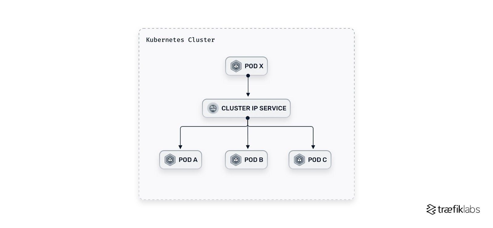
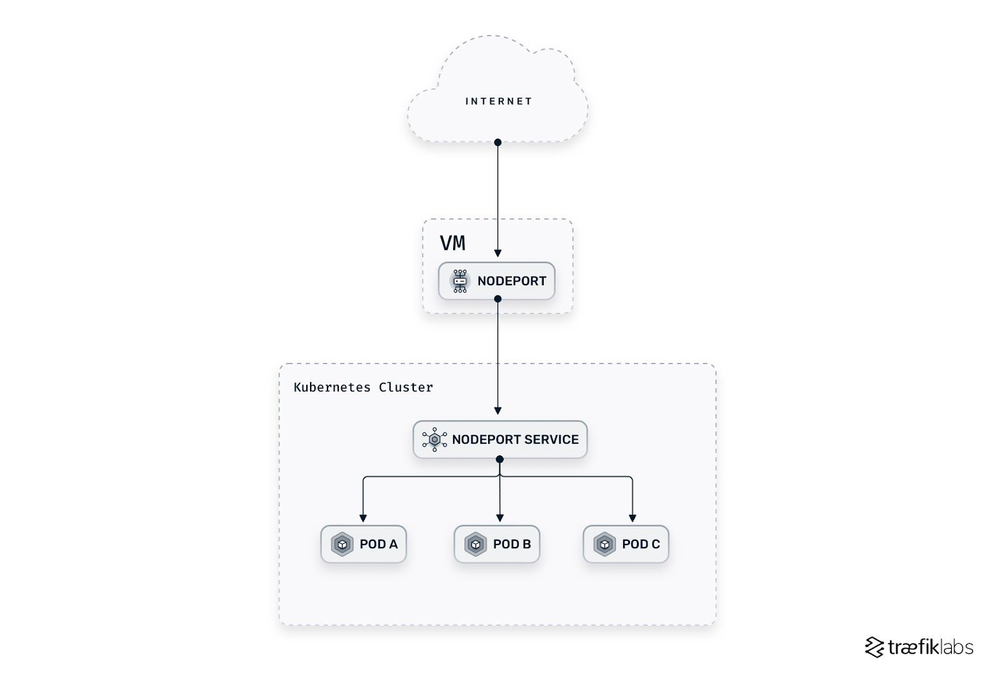
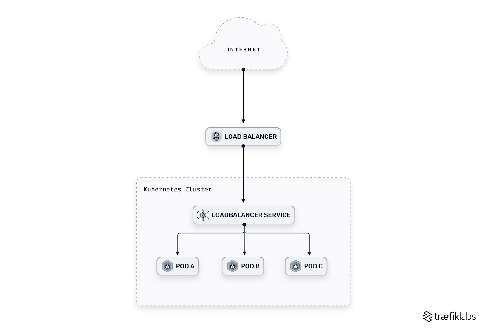
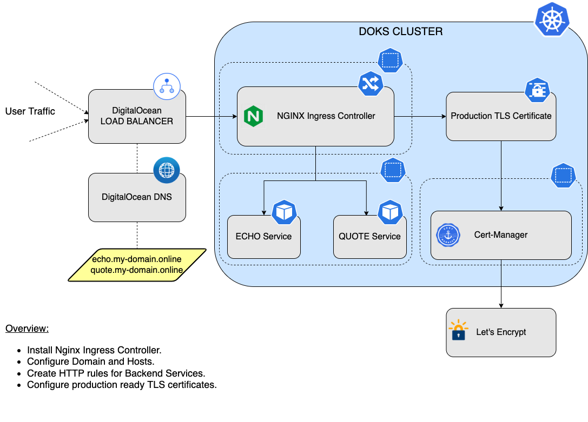

# Kubernetes Primer

- [Kubernetes Primer](#kubernetes-primer)
  - [What is Kubernetes?](#what-is-kubernetes)
  - [Local Deployment](#local-deployment)
  - [Cheat Sheet](#cheat-sheet)
  - [Key Concepts](#key-concepts)
    - [Hardware Concepts](#hardware-concepts)
    - [Software Concepts](#software-concepts)
  - [Key Components](#key-components)
    - [Control Plane Components](#control-plane-components)
    - [Node Components](#node-components)
  - [Concepts Elaborated](#concepts-elaborated)
    - [Data Persistence](#data-persistence)
      - [Volume](#volume)
      - [Persistent Volume (PV)](#persistent-volume-pv)
      - [Persistent Volume Claim (PVC)](#persistent-volume-claim-pvc)
      - [Volume vs PVC vs PV](#volume-vs-pvc-vs-pv)
    - [Namespace](#namespace)
      - [Why Use Namespaces?](#why-use-namespaces)
      - [Creating a Namespace](#creating-a-namespace)
      - [Adding a Namespace](#adding-a-namespace)
      - [Filtering by Namespace](#filtering-by-namespace)
      - [Default Namespaces](#default-namespaces)
      - [Resource Quotas and Limits](#resource-quotas-and-limits)
    - [Services](#services)
      - [ClusterIP](#clusterip)
      - [NodePort](#nodeport)
      - [LoadBalancer](#loadbalancer)
    - [Ingress](#ingress)
      - [Ingress Controller](#ingress-controller)
      - [Traffic Flow with Ingress Controller](#traffic-flow-with-ingress-controller)
    - [Labels](#labels)
      - [Recommended Labels](#recommended-labels)
    - [Label Selectors](#label-selectors)
      - [Equality-Based Selectors](#equality-based-selectors)
      - [Set-Based Selectors](#set-based-selectors)
    - [Annotations vs Labels](#annotations-vs-labels)
    - [Controllers](#controllers)
    - [Pods vs ReplicaSets vs Deployments](#pods-vs-replicasets-vs-deployments)
    - [Health Probes](#health-probes)
    - [Why do we need StatefulSets?](#why-do-we-need-statefulsets)
      - [The Problem](#the-problem)
      - [Using Deployments](#using-deployments)
    - [Using StatefulSets](#using-statefulsets)
      - [Conclusion](#conclusion)
  - [References](#references)
    - [Amazing Blogs](#amazing-blogs)
    - [Udemy Videos](#udemy-videos)

## What is Kubernetes?

- Kubernetes, or `K8s`, is an open-source orchestration system for automating deployment, scaling, and management of containerized applications.
- It manages clusters of servers and runs containers across them, balancing the load.

## Local Deployment

- Multiple known alternatives
- `Docker Desktop` is most popular
- [Refer this doc for details](./K8sWithDockerDesktop.md)

## Cheat Sheet

- [K8s Cheatsheet](https://kubernetes.io/docs/reference/kubectl/cheatsheet/)

## [Key Concepts](https://kubernetes.io/docs/concepts/overview/)

- The `key concepts` are the fundamental building blocks you work with when defining and interacting with your applications in Kubernetes
- [Refer Amazing Blogs section for details](#amazing-blogs)

### Hardware Concepts

- The Hardware Concepts section refers to the physical or virtual resources used by Kubernetes to  run your applications.

| Concept              | Description                                                                                                  |
|----------------------|--------------------------------------------------------------------------------------------------------------|
| **Node**             | A physical or virtual machine running Kubernetes, capable of hosting Pods.                                   |
| **Cluster**          | A set of worker machines, called nodes, that run containerized applications managed by Kubernetes control planes. |
| **Persistent Volume** | A piece of storage in the cluster that has been provisioned by an administrator or dynamically provisioned using Storage Classes. It is a resource in the cluster just like a node is a cluster resource. |

### Software Concepts

- Encompasses the logical constructs and abstractions that make up Kubernetes' functionality

| Concept                     | Description                                                                                                         |
|-----------------------------|---------------------------------------------------------------------------------------------------------------------|
| [**Pod**](https://kubernetes.io/docs/concepts/workloads/pods/)                     | The smallest deployable unit, encapsulating one or more containers.                                                  |
| **Service**                 | A set of Pods working together, exposed as a network service.                                                        |
| [**Deployment**](https://kubernetes.io/docs/concepts/workloads/controllers/deployment/)              | Manages the desired state for Pods and ReplicaSets. Supports updates, rollbacks, and scaling.                        |
| **ReplicaSet**              | Ensures that a specified number of replicas of a Pod are running at all times.                                       |
| **Namespace**               | Logical partitioning of a Kubernetes cluster, used to isolate resources.                                             |
| **ConfigMap**               | Allows you to decouple environment-specific configuration from your container images.                                 |
| **Secret**                  | Used to store sensitive information, such as passwords or API keys in `base64` format                                                  |
| **Volume**                  | Represents a storage location, either on the host or a remote storage solution.                                       |
| [**Ingress**](https://kubernetes.io/docs/concepts/services-networking/ingress/)                 | Manages external access to services within a cluster, typically HTTP.                                                |
| **StatefulSet**             | Manages the deployment and scaling of a set of Pods, with persistent storage and unique network identifiers.          |
| **DaemonSet**               | Ensures all or some Nodes run a copy of a Pod, typically used for node-level system services.                        |
| **Horizontal Pod Autoscaler** | Automatically scales the number of Pods in a deployment, replica set, or replication controller based on observed CPU or memory utilization. |

## [Key Components](https://kubernetes.io/docs/concepts/overview/components/)

- These are the underlying mechanisms that make Kubernetes work as a system
- [Refer doc for details](https://kubernetes.io/docs/concepts/overview/components/)

### Control Plane Components

- Manage the overall state of the cluster

| Component                | Description                                                          |
|--------------------------|----------------------------------------------------------------------|
| **kube-apiserver**       | Exposes the Kubernetes API.                                          |
| **etcd**                 | Consistent and highly-available key-value store for all cluster data. |
| **kube-scheduler**       | Schedules pods to run on nodes.                                      |
| **kube-controller-manager** | Runs controllers for nodes, replicas, endpoints, etc.                |
| **cloud-controller-manager** | Runs controllers specific to the underlying cloud provider.          |

### Node Components

- Run on individual nodes and handle the running of containers

| Component               | Description                                                       |
|-------------------------|-------------------------------------------------------------------|
| **kubelet**             | Ensures that containers are running in a pod.                      |
| **kube-proxy**          | Manages network rules and enables communication to and from your pods. |
| **Container Runtime**   | Software for running containers (e.g., Docker, containerd).       |

## Concepts Elaborated

- A few constructs which are not clearly documented will be covered in this section

Sure thing! Let's break these concepts down into a casual, concise manner:

---

### Data Persistence

#### Volume

`What it is`:

- A directory, possibly with some data in it, which is accessible to the containers in a Pod.
  
`Features`:

- Lifecycle of a volume is tied to the lifecycle of a Pod.
- Supports several types of storage backends (like `emptyDir`, `hostPath`, cloud providers, NFS, etc.)
  
`Why you'd use it`:

- You want to store data temporarily or share data between containers in a Pod.

---

#### Persistent Volume (PV)

`What it is`:

- A piece of storage in a cluster provisioned by an admin.
  
`Features`:

- It's a resource in the cluster just like a node.
- Detached from the lifecycle of a Pod, meaning the data persists beyond Pod's life.
- Supports multiple storage backends.

`Why you'd use it`:

- You need storage that persists beyond the life of a Pod.
- You want to manage storage resources in a standardized way across the cluster.

---

#### Persistent Volume Claim (PVC)

`What it is`:

- A request for storage by a user, which can be fulfilled by a PV.
  
`Features`:

- Allows a user to claim specific size and access modes.
- Acts as a bridge between the user and the PV, abstracting the details of how storage is provided.
  
`Why you'd use it`:

- You're a user who needs a certain amount of storage without caring about the underlying details.
- You want Kubernetes to handle the binding between your request and the available PVs.

---

#### Volume vs PVC vs PV

1. **Volume:** Temporary storage for a Pod.
2. **PV:** Long-term storage resource in the cluster.
3. **PVC:** A way to request a chunk of that PV storage.

`Real-life Analogy`:

- Think of **PV** as a big parking lot. It's a resource with many parking spaces.
- **PVC** is like a parking ticket where you mention your requirements (e.g., I need a space for my SUV). Now, when you come with your ticket (PVC), the parking manager (Kubernetes) assigns a spot suitable for your SUV from the parking lot (PV).
- The **Volume** is equivalent to the actual space where the car is parked, but it's temporary. Once you leave, that particular space might be used by someone else.

---

### [Namespace](https://kubernetes.io/docs/concepts/overview/working-with-objects/namespaces/)

- It provides a mechanism for isolating groups of resources within a single cluster.
- Names of resources need to be unique within a namespace, but not across namespaces.
- `Namespace-based scoping` is applicable only for `namespaced objects` (e.g. *Deployments*, *Services*, etc) and not for `cluster-wide objects` (e.g. *StorageClass*, *Nodes*, *PersistentVolumes*, etc).
- Think of them as virtual walls within a Kubernetes cluster that separate different environments, such as development, staging, and production or apps and databases.

#### Why Use Namespaces?

1. `Isolation`: Namespaces provide a scope for names, ensuring that resources are isolated from each other.
2. `Organization`: By grouping related resources together, namespaces simplify management and access control.
3. `Resource Allocation`: You can set resource limits on a per-namespace basis, ensuring fair usage across different teams or applications.
4. `Access Control`: You can set different permissions for different namespaces, allowing precise control over who can do what within each environment.

#### Creating a Namespace

- A namespace can be created using a YAML file like the following:

```yaml
apiVersion: v1
kind: Namespace
metadata:
  name: my-namespace
```

- A simple command-line instruction:

```bash
kubectl create namespace my-namespace
```

#### Adding a Namespace

Once a namespace is created, you can create, view, and manage resources within that namespace. When creating a resource, you can specify the namespace in the YAML file:

```yaml
apiVersion: v1
kind: Pod
metadata:
  name: my-pod
  namespace: my-namespace
```

#### Filtering by Namespace

```bash
kubectl get pods --namespace=my-namespace
```

#### Default Namespaces

Kubernetes comes with a few default namespaces:

- `default`: Where resources are placed if no namespace is specified.
- `kube-system`: Used by resources that are part of Kubernetes itself.
- `kube-public`: Typically used for resources that need to be accessible across the entire cluster.

#### Resource Quotas and Limits

You can set quotas and limits on resources within a namespace to control CPU, memory, and other resource utilization. Here's an example:

```yaml
apiVersion: v1
kind: ResourceQuota
metadata:
  name: my-quota
  namespace: my-namespace
spec:
  hard:
    pods: '10'
    requests.cpu: '4'
```

---

### [Services](https://traefik.io/glossary/kubernetes-ingress-and-ingress-controller-101/)

- 3 Primary Services in K8s:
  - **ClusterIP**
  - **NodePort**
  - **LoadBalancer**

#### ClusterIP

- A ClusterIP Service is exposed on an internal cluster IP and is reachable from `within` the cluster
- It is the default setting in Kubernetes.



#### NodePort

- A NodePort Service asks Kubernetes to open a `static port` in every cluster node on a high port between 30,000 and 32,767 (by default).
- It is exposed on the IP of each node and is automatically routed to a ClusterIP Service that it creates



#### LoadBalancer

- A load balancer (LB) exposes the Service externally using `a cloud provider’s load balancer`
- It builds on top of the NodePort and ClusterIP services and introduces a stable, IP address or DNS name through which external traffic can access an application
- This option is expensive as it requires each Service to have its own IP address and cloud provider’s load balancer



- When a K8s LoadBalancer Service is created on a Cloud deployment, the `k8s control plane` recognizes it and communicates with the cloud provider's API
- The cloud provider provisions an `external load balancer` and registers it with the K8s control plane
- A stable IP address (*or a DNS name*) is assigned to the load balancer.
- The control plane then configures the load balancer to forward traffic to the Service's `ClusterIP` address

---

### Ingress

- `Ingress` is an API object that manages external access to services within a cluster, typically HTTP.
- It provides:
  - `Host and Path-Based Routing`: Direct traffic to specific services based on URL paths or hostnames.
  - `SSL/TLS Termination`: Secure your services by handling SSL/TLS at the Ingress level.
  - `Rewrites and Redirects`: Modify the request/response content without changing the application.
- However, merely defining an Ingress resource isn't enough.
- It's the job of `Ingress Controller` to read the Ingress's configurations and appropriately route the traffic.

#### Ingress Controller

- It's not a single, standalone resource.
- It a combination of resources that together facilitate the functionality of handling Ingress requests.

**Components of an Ingress Controller:**

1. `Controller Software`:
   - This is the actual controller component, which is continuously running and watching for changes to Ingress resources.
   - When changes are detected, it updates its configuration accordingly.
   - Popular examples include `ingress-nginx`, `traefik`, and `HAProxy Ingress`.

2. `Pods`:
   - The controller software typically runs within one or more Pods.
   - These Pods are responsible for routing the incoming traffic based on `Ingress` rules.

3. `ConfigMap/Secrets`:
   - Ingress Controllers often use ConfigMaps and Secrets to store configurations and TLS certificates, respectively.
   - Changes to these resources can lead the controller to reload or update its configuration.

4. `Service`:
   - To expose the Ingress Controller Pods to external traffic, there's typically a Service of type `LoadBalancer` or `NodePort` associated with it.

5. `RBAC (Roles, RoleBindings, ServiceAccounts)`:
   - To securely access and watch the Ingress resources and associated configurations, the Ingress Controller often runs with specific ServiceAccount, Role, and RoleBinding settings.

6. `Backend Pods and Services`:
   - While not part of the Ingress Controller per se, these are essential components in the whole setup.
   - The Ingress Controller uses the Ingress rules to route traffic to these backend services and eventually to the backend pods.

7. `Ingress Resources`:
   - Although separate from the Ingress Controller, Ingress resources define the rules for how traffic should be routed.
   - The Ingress Controller watches and implements these rules.

#### Traffic Flow with Ingress Controller



1. `External Traffic`:
   - External traffic, such as user requests from the internet, first hits the public-facing external load balancer.

2. `External Load Balancer (ELB)`:
   - Managed by the cloud provider (like AWS ELB, Google Cloud Load Balancer, Azure Load Balancer, DigitalOcean Load Balancer, etc.).
   - It's designed to distribute incoming traffic across multiple nodes in the Kubernetes cluster.
   - The ELB is configured to know which node ports to forward traffic to, usually by the LoadBalancer service.

3. `LoadBalancer Service`:
   - It's a Kubernetes service of type `LoadBalancer`.
   - Acts as an interface between the external load balancer and the internal ClusterIP services and pods.
   - Requests the cloud provider to provision an external load balancer (or utilizes an existing one) and automatically configures it to forward traffic to the service's pods, often via NodePorts.

4. `ClusterIP Service`:
   - Once the traffic reaches the cluster (thanks to the LoadBalancer service), the `ClusterIP` service takes over.
   - `ClusterIP` is the default type of service in Kubernetes. It exposes the service on an internal IP in the cluster, making the service reachable only from within the cluster.
   - In the context of `ingress-nginx`, this service forwards the traffic to the `ingress controller pods`.

5. `Ingress-nginx Controller Pods (with NGINX)`:
   - Inside these pods is where the actual decisions on traffic routing, based on the host, path, or other request parameters, are made.
   - They continuously watch for changes in Ingress resources across the cluster.
   - When a request comes in, the embedded NGINX determines the destination using Ingress rules, guiding the traffic to the appropriate service within a specific namespace (`dev`, `prod`, etc.).

6. `Ingress Resources`:
   - These are defined per application or environment. They dictate how incoming requests should be routed.
   - For instance, requests with a host header of `dev.botiga.com` might be routed to services in the `dev` namespace, while `prod.botiga.com` would target services in the `prod` namespace.

7. `Destination Services & Pods`:
   - Based on the decisions made by NGINX in the ingress controller pods, traffic is then forwarded to the target services.
   - These services, in turn, route the traffic to the respective application pods in their designated namespaces (`dev`, `prod`, etc.).

In this model, the `LoadBalancer` service effectively bridges the gap between the external world and your Kubernetes cluster, ensuring traffic can smoothly flow into your applications. The combination of both LoadBalancer and ClusterIP services with the `ingress-nginx` controller pods allows for efficient, rule-based routing of external traffic deep into the appropriate areas of the cluster.

---

### [Labels](https://kubernetes.io/docs/concepts/overview/working-with-objects/labels/)

- Labels are `key-value` pairs attached to Kubernetes objects like Pods, Services, etc.
- Labels enable users to map their own organizational structures onto system objects in a loosely coupled fashion
- `A single object can have multiple labels.`
- `Labels are not unique`. Similar objects often share labels.
- Labels can be attached to objects at creation time and subsequently added and modified at any time
- Usages:
  - To identify attributes of objects that are meaningful and relevant to users
  - To filter resouces using `label selectors`

```yaml
metadata:
  labels:
    env: prod
    tier: backend
    app: auth
    release: stable
```

- Above example has 3 labels

#### [Recommended Labels](https://kubernetes.io/docs/concepts/overview/working-with-objects/common-labels/)

- Recommended labels in Kubernetes are standardized metadata that allow you to identify, manage, and query resources.
- By adopting a common set of labels across resources, it promotes consistent handling and provides a shared standard across different projects and tools.

- Here's a list of recommended labels along with their descriptions:

| Label                      | Description                                                                                     |
|----------------------------|-------------------------------------------------------------------------------------------------|
| `app.kubernetes.io/name`   | The name of the application (e.g., "mysql").                                                    |
| `app.kubernetes.io/instance` | A unique instance name of the application (e.g., "wordpress-abcxzy").                           |
| `app.kubernetes.io/version`  | The version of the application (e.g., "v1.0.0").                                                |
| `app.kubernetes.io/component` | The component within the architecture (e.g., "database", "webserver").                          |
| `app.kubernetes.io/part-of`  | The name of a higher-level application that this is a part of (e.g., "wordpress").               |
| `app.kubernetes.io/managed-by` | The tool being used to manage the operation of an application (e.g., "helm").                     |

- **Example Usage**

```yaml
apiVersion: apps/v1
kind: Deployment
metadata:
  name: my-app
  labels:
    app.kubernetes.io/name: my-app
    app.kubernetes.io/instance: my-app-12345
    app.kubernetes.io/version: "1.0.0"
    app.kubernetes.io/component: backend
    app.kubernetes.io/part-of: bigger-app
    app.kubernetes.io/managed-by: helm
```

- **Benefits**

- **Consistency:** Using the same labels across different parts of an application helps in managing and querying resources.
- **Integration:** Many tools recognize and leverage these labels, allowing for smoother integration and understanding between different parts of the Kubernetes ecosystem.

Adhering to the set of recommended labels makes it easier to manage applications, enhances interoperability, and promotes best practices within the Kubernetes community.

---

### Label Selectors

- Selectors are expressions that match against the labels of resources
- Think of selectors as search queries that find objects with specific labels.
- 2 types of Selectors:

#### Equality-Based Selectors

- Equality-based selectors allow you to filter resources based on exact key-value matches.

```yaml
selector:
  matchLabels:
    env: prod
    app: web
```

- The above example will match resources that have `both` the `env: prod` and `app: web` labels.

#### Set-Based Selectors

- Set-based selectors allow for more flexibility, letting you match resources based on conditions like `existence`, `in`, `not in`, etc.

```yaml
selector:
  matchExpressions:
    - {key: env, operator: In, values: [prod, staging]}
    - {key: app, operator: NotIn, values: [auth]}
    - {key: tier, operator: Exists}
```

In this example:

- The first expression matches if the `env` label has a value of either `prod` or `staging`.
- The second expression matches if the `app` label does not have the value `auth`.
- The third expression matches if the `tier` label exists, regardless of its value.

You can `combine` equality-based and set-based selectors as needed to match resources based on complex criteria.

---

### Annotations vs Labels

| Feature              | Labels                    | Annotations               |
|----------------------|---------------------------|----------------------------|
| **Purpose**          | Identify and select objects| Attach non-identifying metadata|
| **Use Cases**        | Filtering, grouping resources| Additional information, tool metadata|
| **Searchable**       | Yes                       | No                         |
| **Syntax**           | Key/Value pairs           | Key/Value pairs            |
| **Modification**     | Dynamic                   | Dynamic                    |
| **Visibility**       | Used by Kubernetes system | Primarily for end-users/tools|
| **Character Limit**  | 63 chars for key and value| No specific limit           |
| **Validation**       | Specific constraints      | No specific constraints     |

---

### Controllers

- Controllers are control loops that watch the state of your system, then make or request changes where necessary.
- Controllers automate the management of different aspects of the cluster.
- They handle aspects such as replication, deployment, scheduling, and more.
- They continuously watch the current state of the cluster, compare it to the desired state defined in the configuration, and take actions to align the two states.
- Controllers encapsulate the control logic that drives the automated management of Kubernetes clusters, allowing for self-healing, scaling, and updating of applications.

- `How Controllers Work`

  - **Observe:** They continuously monitor the current state of the cluster.
  - **Analyze:** They compare the current state with the desired state defined in the configuration.
  - **Act:** They perform actions to reconcile the current state with the desired state.

- `Types of Controllers`

| Controller            | Description                                                                 |
|-----------------------|-----------------------------------------------------------------------------|
| ReplicaSet Controller | Ensures the desired number of replicas for a Pod are running. Creates or deletes Pods as necessary.  |
| Deployment Controller | Manages the lifecycle of applications. Facilitates updates, rollbacks, and scaling.  |
| DaemonSet Controller  | Ensures that specific Pods run on all (or selected) nodes in the cluster.    |
| StatefulSet Controller| Manages stateful applications with stable network IDs, persistent storage, and ordered deployment. |
| Job Controller        | Manages one-off tasks that need to run to completion.                        |
| CronJob Controller    | Schedules Jobs to run at specified times or intervals.                       |

- `Example`: ReplicaSet Controller

```yaml
apiVersion: apps/v1
kind: ReplicaSet
metadata:
  name: my-replicaset
spec:
  replicas: 3
  selector:
    matchLabels:
      app: my-app
  template:
    metadata:
      labels:
        app: my-app
    spec:
      containers:
      - name: nginx-container
        image: nginx
```

---

### Pods vs ReplicaSets vs Deployments

| Feature                      | Pod           | ReplicaSet     | Deployment      |
|------------------------------|---------------|----------------|-----------------|
| **Definition**               | Single unit hosting one or more containers | Ensures desired number of Pods are running | Manages ReplicaSets & enables rolling updates |
| **Granularity**              | Individual container(s) | Group of identical Pods | Manages multiple ReplicaSets for different versions |
| **Scaling**                  | Manual        | Manual         | Automatic (up & down) |
| **Rolling Updates**          | Not supported | Not supported  | Supported        |
| **Rollbacks**                | Not supported | Not supported  | Supported        |
| **Recovery**                 | No automatic replacement | Replaces failed Pods | Replaces failed Pods through ReplicaSets |
| **Versioning**               | N/A           | N/A            | Manages different versions with ease |
| **Use Case**                 | Basic container orchestration | Ensuring specific count of identical Pods | Full application lifecycle management |

**Summary**:

- **Pod:** A foundational unit containing one or more containers. Useful for simple scenarios but lacks automation features.
- **ReplicaSet:** Ensures that a specified number of identical Pods are running. Can replace failed Pods but doesn't support updates or scaling easily.
- **Deployment:** A higher-level abstraction that manages ReplicaSets, providing seamless scaling, updates, rollbacks, and versioning.


---

### [Health Probes](https://medium.com/dev-genius/understanding-kubernetes-probes-5daaff67599a)

- One of the challenges with distributed systems and microservices architecture is automatically detecting unhealthy applications, rerouting requests to other available systems, and restoring the broken components.
- Health checks are one way to address this challenge and ensure reliability.

| Probe Type    | Description                                                                                                   | When Used                                                   | Configuration Parameters                         |
|---------------|---------------------------------------------------------------------------------------------------------------|------------------------------------------------------------|---------------------------------------------------|
| **Liveness**  | Determines if the pod is running. If the check fails, the container is killed and subjected to its restart policy. | Ensure the container is healthy and responsive.            | `initialDelaySeconds`, `timeoutSeconds`, `periodSeconds`, `successThreshold`, `failureThreshold` |
| **Readiness** | Determines if the pod should receive traffic. If the check fails, the pod is removed from service load balancers. | Ensure the app inside the container is fully initialized and ready to accept traffic. | `initialDelaySeconds`, `timeoutSeconds`, `periodSeconds`, `successThreshold`, `failureThreshold` |
| **Startup**   | Determines if the application within the pod has started. If the check fails, the container is killed and restarted. | Ensure the app inside the container has started up correctly. | `failureThreshold`, `periodSeconds` |

---

### Why do we need StatefulSets?

- Let's dive deep into why StatefulSets are essential using an illustrative example of `Database Clustering`.

#### The Problem

- Imagine we're working with a database that supports clustering, like `Cassandra` or `MongoDB`.
- In a cluster, each database node needs to have a unique identity to `communicate`, `form quorums`, `manage leader elections`, etc.
- For instance, in a Cassandra cluster:
  - Nodes need a stable network identity.
  - Data stored in each node is different, and nodes can't be interchangeably destroyed and recreated.
  - Nodes need to join the cluster in a particular order for smooth scaling and recovery.

#### Using Deployments

If we try to deploy a Cassandra cluster using a Kubernetes Deployment:

- `Lack of Stable Network Identity`: Pods created by a Deployment get random identities. If a pod dies and is recreated, its identity changes. This behavior can disrupt the Cassandra cluster's communication and functioning.
- `State Persistence Issues`: While you can attach a persistent volume to a Deployment, if a pod dies and gets scheduled on another node, it won't necessarily have the same data volume attached. Data can get lost or mixed up.
- `Scaling Complications`: Deployments don't control the order of pod creation or termination. This lack of control can disrupt the orderly joining or leaving of nodes in a Cassandra cluster.

### Using StatefulSets

Now, let's see how a StatefulSet addresses these challenges:

- `Stable Network Identity`: Each pod gets a consistent identity like `cassandra-0`, `cassandra-1`, and so on. Even if `cassandra-0` dies and gets rescheduled, it'll retain its identity. The cluster can continue functioning without disruption.
- `Guaranteed State Persistence`: Each pod in a StatefulSet can be associated with a unique PersistentVolumeClaim (PVC). So, `cassandra-0` will always get its data, even if it's rescheduled to a different node.
- `Ordered Scaling`: Pods are created and terminated in a specific order, ensuring nodes join or leave the Cassandra cluster gracefully.

#### Conclusion

- While Deployments are excellent for stateless apps, where each instance is identical, they're not suited for stateful applications like databases.
- StatefulSets are designed to handle the complexities of state, providing pods with a stable identity, ensuring ordered scaling, and guaranteeing data persistence.
- Without StatefulSets, managing stateful applications in Kubernetes would be much more complex and error-prone.

## References

### Amazing Blogs

- [Docker & Kubernetes Primer](https://medium.com/free-code-camp/learn-kubernetes-in-under-3-hours-a-detailed-guide-to-orchestrating-containers-114ff420e882)
- [K8s Pictorially](https://blog.tarkalabs.com/know-kubernetes-pictorially-f6e6a0052dd0)
- [Key Concepts](https://towardsdatascience.com/key-kubernetes-concepts-62939f4bc08e)
- [Kuberneter 101](https://medium.com/google-cloud/kubernetes-101-pods-nodes-containers-and-clusters-c1509e409e16)
- [What is a Pod - A Primer on Networking in K8s](https://medium.com/google-cloud/understanding-kubernetes-networking-pods-7117dd28727)
- [Nodeport vs LoadBalancer vs Ingress](https://medium.com/google-cloud/kubernetes-nodeport-vs-loadbalancer-vs-ingress-when-should-i-use-what-922f010849e0)
- [Config Maps & Secrets](https://medium.com/google-cloud/kubernetes-configmaps-and-secrets-68d061f7ab5b)
- [K8s CLI Tools](https://medium.com/free-code-camp/how-to-set-up-a-serious-kubernetes-terminal-dd07cab51cd4)
- [RBAC Introduction](https://medium.com/devops-mojo/kubernetes-role-based-access-control-rbac-overview-introduction-rbac-with-kubernetes-what-is-2004d13195df)

---

### Udemy Videos

- [Services in K8s](https://www.udemy.com/course/docker-and-kubernetes-the-complete-guide/learn/lecture/11482938#overview)
- [Why use Services](https://www.udemy.com/course/docker-and-kubernetes-the-complete-guide/learn/lecture/11482970#overview)
- [Deployment vs Pods](https://www.udemy.com/course/docker-and-kubernetes-the-complete-guide/learn/lecture/11482960#overview)
- [K8s Volumes](https://www.udemy.com/course/docker-and-kubernetes-the-complete-guide/learn/lecture/11514746#overview)
- [Load Balancing with Ingress](https://www.udemy.com/course/docker-and-kubernetes-the-complete-guide/learn/lecture/11582340#overview)
- [Https Setup for K8s](https://www.udemy.com/course/docker-and-kubernetes-the-complete-guide/learn/lecture/11628346#overview)
