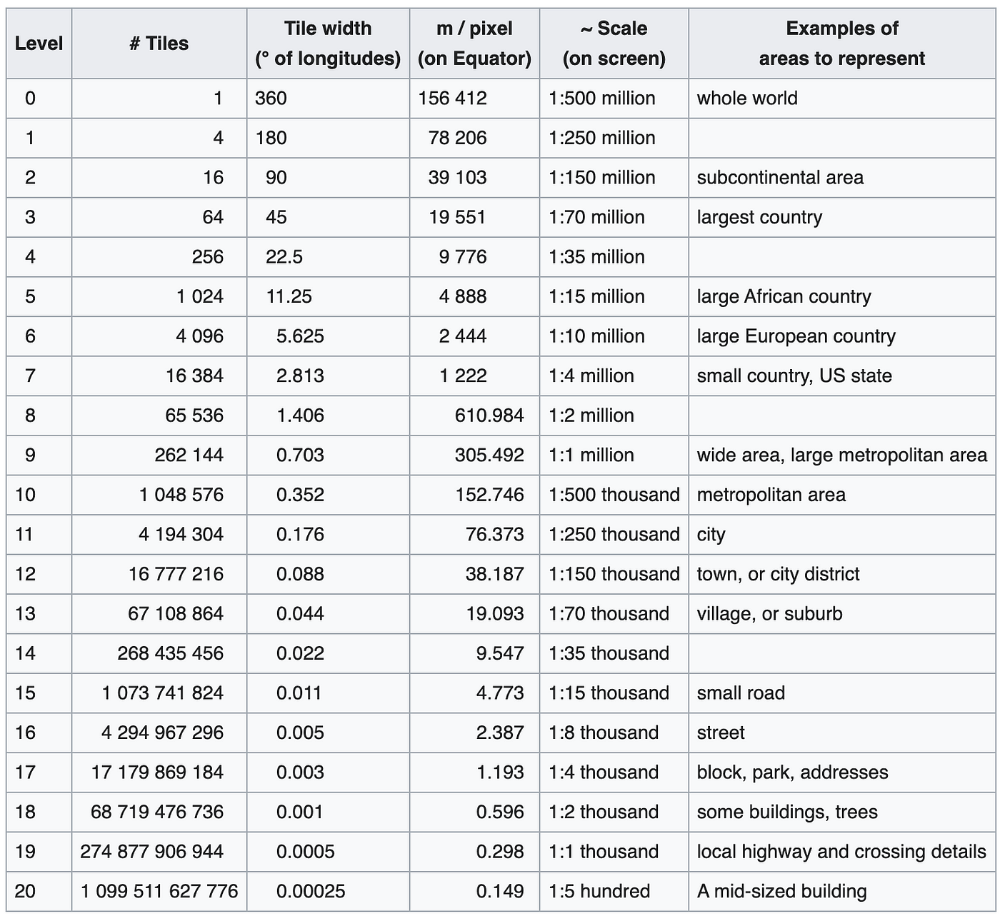
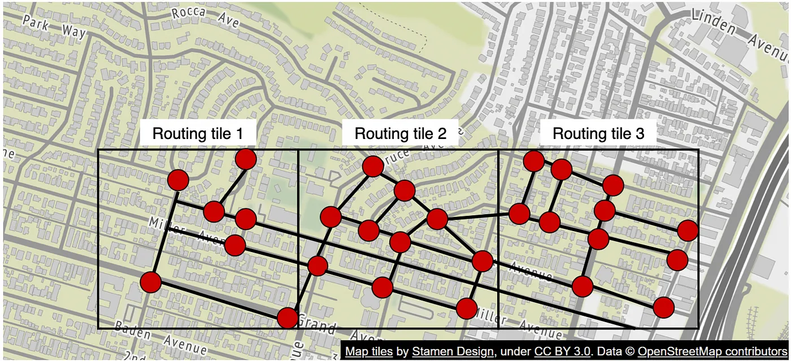

# Google Maps

- [Google Maps](#google-maps)
  - [Map Tiles](#map-tiles)
    - [What are Map Tiles?](#what-are-map-tiles)
    - [Storage and Hierarchical Structure](#storage-and-hierarchical-structure)
    - [Rendering on Devices](#rendering-on-devices)
    - [Static Image Representation](#static-image-representation)
  - [Routing Tiles](#routing-tiles)
    - [Concept and Purpose](#concept-and-purpose)
    - [Structure and Storage](#structure-and-storage)
    - [Efficiency and Processing](#efficiency-and-processing)
    - [How Routing Tiles Work](#how-routing-tiles-work)
    - [Rendering Directions](#rendering-directions)
  - [Integration of Map Tiles and Routing Tiles](#integration-of-map-tiles-and-routing-tiles)
    - [User Journey Example](#user-journey-example)
  - [Accuracy and Data Sources](#accuracy-and-data-sources)
    - [Accuracy of Streets](#accuracy-of-streets)
    - [Data Processing](#data-processing)
    - [Continuous Updates](#continuous-updates)
  - [Conclusion](#conclusion)

Google Maps is a sophisticated mapping service that leverages various technologies to provide accurate and efficient navigation.

This document provides a comprehensive overview of how Google Maps uses map tiles for rendering maps and routing tiles for calculating directions, incorporating real-time data for optimal route planning.

---

## Map Tiles

### What are Map Tiles?

- Suppose you want to render world map on a Web App at different Zoom levels
- Starting image size is `512x512`
- Subsequent Zoom level would have `4x Clarity/Details` the information
- Now, we have 2 ways:
  - `Option 1`: 1 Image at each Zoom level
    - This works fine at a very high zoom level
    - A small size image of `512x512` at `Zoom 0` would serve the purpose. Image Size - `256KB`
    - Zoom 1 - `512x512x4 = 2048x2048 = 4MB`
    - Zoom 2 - `2048x2048x4 = 16MB`
    - Zoom 3 - 64MB
    - Zoom 4 - 256MB
    - Zoom 5 - `1GB`
    - We need Zoom upto level 25 & just at Zoom 5, we have 1GB Image
    - Downloading & Rendering such an image would be time & cpu intensive
  - `Option 2`: Each Image has a fixed size of `512x512` & data is split between images
    - `Zoom 0` - 1 image of `512x512`
    - Zoom 1 - 4 images of `512x512`
    - Zoom 2 - 16 images
    - Zoom 3 - 64 images
- As we can see that option 2 scales well, so Map data is divided into images as we Zoom
- These images are called `Map Tiles`:
  - `Map tiles` are small, square images that represent a specific geographic area at a specific zoom level
  - These tiles are pieced together to form the complete map that users see in Google Maps
- [Reference Videos](https://www.youtube.com/watch?v=_do0Mc5uYzs)

### Storage and Hierarchical Structure

1. `Tile Pyramid`: Google Maps uses a tile pyramid structure to manage map tiles. At each zoom level, the world map is divided into increasingly smaller tiles:
   - `Zoom Level 0`: The entire world fits into one tile.
   - `Zoom Level 1`: The world is divided into 4 tiles (2x2 grid).
   - `Zoom Level 2`: The world is divided into 16 tiles (4x4 grid), and so on.
   - `No of Tiles at a Zoom level n`: Zoom level 0 has 1 tile & each tile is next Zoom level is broken into 4 tile in next zoom level. So, tiles at Zoom level **n** - `4^n`

2. `Storage Format`:
   - Tiles are typically stored in compressed formats such as `PNG` or `JPEG` to save space and bandwidth

3. `Content Delivery Networks (CDNs)`:
   - Google uses a network of geographically distributed servers to store tiles
   - CDNs reduce latency and speed up the delivery of tiles to users.

### Rendering on Devices

1. `Pre-fetching`: The app pre-fetches and caches tiles for the surrounding area to ensure a smooth experience when panning the map.
2. `Caching`: Frequently accessed tiles are cached on the device to minimize redundant downloads and improve speed.
3. `Efficient Requests`: The app requests only the necessary tiles based on the user's viewport and zoom level.
4. `Tiling`: The app assembles and renders the tiles quickly to display the map seamlessly as the user navigates.

### Static Image Representation

- Each map tile is a static image representing a small, fixed portion of the map at a specific zoom level.
- Typically, each tile is 512x512 pixels.
- The map displayed on the device is a composite of many such tiles stitched together.

---

## Routing Tiles

### Concept and Purpose

- Routing Tiles are a `Server-Side Concept`
- Google Maps uses `Graphs` to represent `road data` for navigation purposes
- In this graph, *roads* form `edges` & *intersections* form `nodes`
- And a variation of `Dijkstra's` algo is used to identify shorted path between `Point A -> B`
- Now, the question is `how big the graph should be?`
  - Should we have 1 graph for whole world?
  - Or graph for each country?
  - or for each city or county?
- In real world applications, `performance of path finding algos is extremely senstive to size of graph`
- So, smaller the graph, faster the evalution
- Inspired by Map tiles, the `road graphs` were broken into very small pieces of road data called - `routing tiles`
- For `A -> B` navigation, shorted path would be calculated for many such graphs & then, sitched together to provide correct answer
- Essentially, `Routing tiles` are used to efficiently calculate routes for navigation
- Unlike map tiles, which are primarily for visual representation, routing tiles contain detailed data about the road network

    

### Structure and Storage

1. `Graph Representation`: Routing tiles store road networks as graph data structures. Nodes represent intersections or waypoints, and edges represent road segments.
2. `Hierarchical Organization`: The road network is partitioned into smaller, manageable tiles, similar to map tiles, but optimized for routing.
3. `Data Format`: Routing tiles are typically stored in binary formats optimized for fast read and write operations.
4. `Distributed Storage`: Data is stored in a distributed database system (e.g., Google Cloud Bigtable) to ensure scalability and reliability.

### Efficiency and Processing

1. `Scalability`: Storing the entire road network as a few large graphs would be computationally expensive. Routing tiles break down the network into smaller graphs, making route calculations more efficient.
2. `Real-Time Data`: Traffic conditions, road closures, and other real-time data are integrated into routing tiles to provide up-to-date routing information.

### How Routing Tiles Work

1. `User Requests Directions`: The user inputs a destination and requests directions.
2. `Server-Side Processing`:
   - The server identifies the relevant routing tiles for the source, destination, and potential paths.
   - These tiles are fetched and processed to calculate the optimal route.
3. `Graph Data`: The server uses the graph data from the routing tiles, considering real-time traffic and road conditions.
4. `Route Calculation`: The optimal route is calculated using algorithms that process the graph data.
5. `Returning the Route`: The calculated route is sent back to the app.

### Rendering Directions

1. `Overlaying on Map Tiles`: The app overlays the calculated route on the map tiles.
2. `Turn-by-Turn Navigation`: The app provides turn-by-turn navigation instructions based on the calculated route.

---

## Integration of Map Tiles and Routing Tiles

### User Journey Example

1. `Opening Google Maps`:
   - The user opens the Google Maps app.
   - The app requests map tiles for the current view and pre-fetches nearby tiles.

2. `Requesting Directions`:
   - The user inputs a destination.
   - The app sends a routing request to the server.

3. `Fetching Data`:
   - The server fetches relevant routing tiles and map tiles.
   - Routing tiles provide data for route calculation.
   - Map tiles provide visual representation.

4. `Calculating the Route`:
   - The server uses the routing tiles to calculate the optimal route.
   - Real-time traffic data is integrated to ensure accuracy.

5. `Rendering the Route`:
   - The app overlays the calculated route on the map tiles.
   - The user sees the route highlighted on the map and receives turn-by-turn navigation instructions.

6. `Dynamic Updates`:
   - As the user follows the route, the app updates the displayed route based on real-time conditions.
   - New tiles are fetched as the user moves, and routing adjustments are made if necessary.

---

## Accuracy and Data Sources

### Accuracy of Streets

Google Maps displays streets accurately due to the integration of various data sources:

- `Satellite Imagery`: High-resolution images provide detailed views of the Earth's surface.
- `Street View Imagery`: Ground-level images capture street details.
- `GPS Data`: Real-time data from devices helps verify road layouts.
- `Public and Government Data`: Official maps and records provide reliable information.
- `User-Generated Data`: Contributions from users help keep maps current.
- `Commercial Data Providers`: Licensed data from third-party providers enhances accuracy.

### Data Processing

- `Data Fusion`: Integrating multiple data sources ensures a comprehensive and accurate map.
- `Machine Learning and AI`: Advanced algorithms analyze data to identify patterns and correct inaccuracies.
- `Manual Verification`: Human operators validate data in complex or newly developed areas.

### Continuous Updates

- `Real-Time Updates`: Traffic and road conditions are updated in real-time.
- `Change Detection`: Algorithms detect changes in satellite imagery and user reports, triggering map updates.

---

## Conclusion

Google Maps uses a sophisticated system of map tiles and routing tiles to provide accurate and efficient navigation. Map tiles render the visual map, while routing tiles enable fast and precise route calculations. Real-time data integration ensures that users receive the most current and reliable directions. Understanding these concepts provides insight into the complexity and efficiency of modern digital mapping services.
